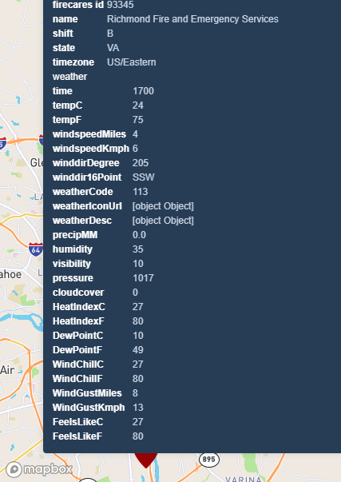

# Richmond Fire Data Enrichment Project

I thoroughly enjoyed working on this project. As you already know, I have been stuck working on an aging stack for almost a decade. I loved digging into Node, Express, React, MapBox GL, etc. I wish I had more time to demonstrate some front end design, but alas, time runs short. Thank you for considering my application and this project.

*Some info about the project structure*
This app has two projects, a Node Express app for the back end and a React app for the front end. This allows for hot reloading and all the goodies provided by the create-react-app boilerplate, while providing a nice space to perform back end tasks like ETL. The front end app runs on http://localhost:3000 with a proxy to the back end which runs on port 3001. 

*Installing and running*
1. run `yarn install`
2. run `cd client && yarn install`
3. run `cd ..\server && yarn install`
4. run `cd .. && yarn start`
5. In order to test a new CAD data file, replace the data.json file located within the data folder.

*Next steps*
1. The example app performs enrichment when the client app loads. A better structure would allow the backend processing to be saved into a database and served up faster.
2. The client side display of attributes needs a lot of improvement. We should add an info panel to the side that has expando sections for each major type (e.g. weather, location, etc.)
3. More interesting derived data products can b

*Total time spent*
I spent about 6 hours on this project, with lots of interruptions! 

*Screen shot*

